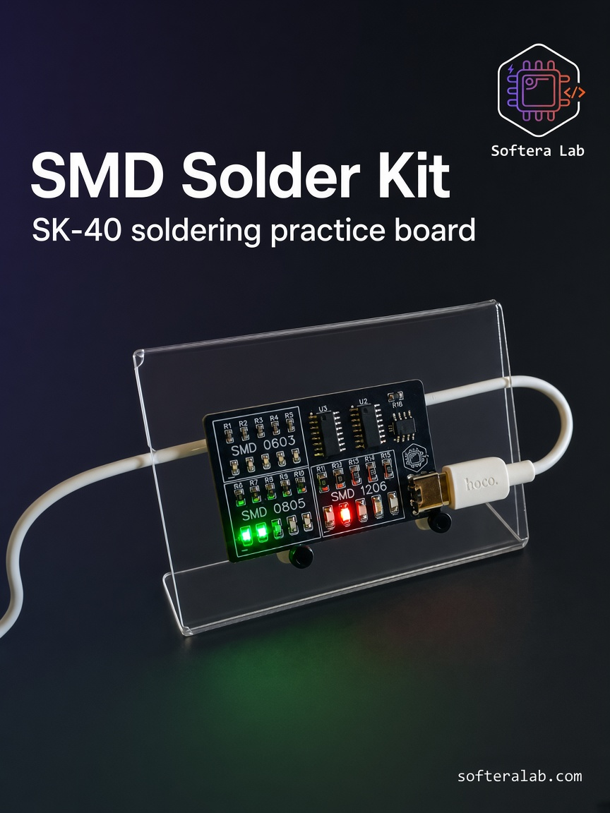
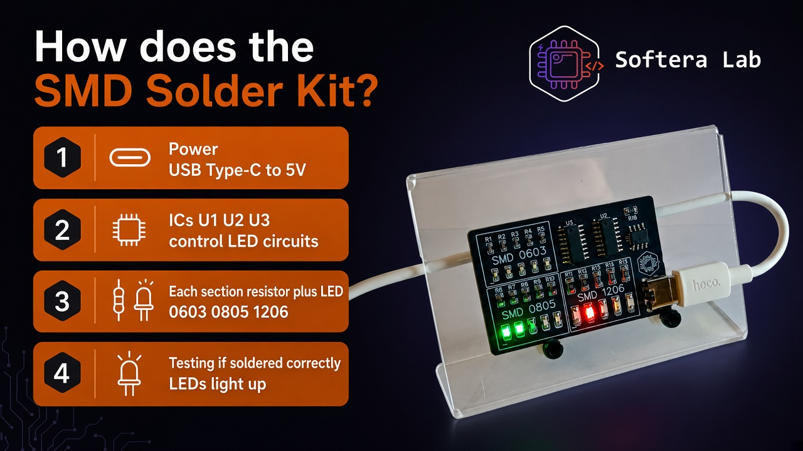
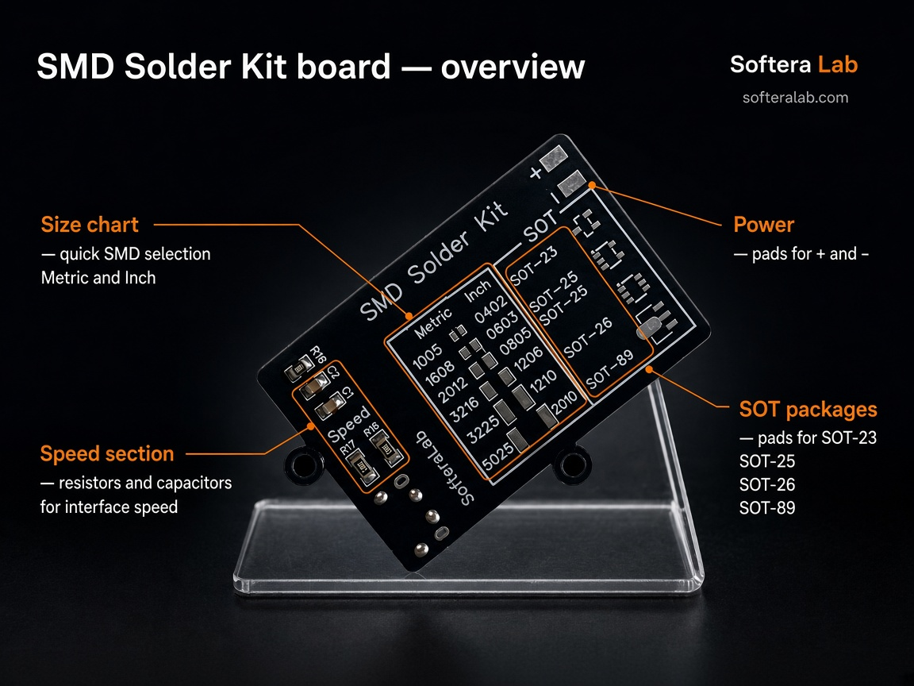
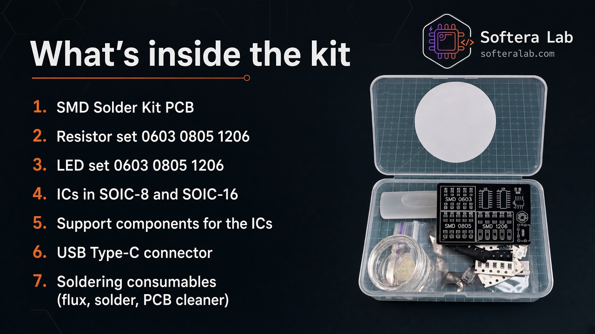
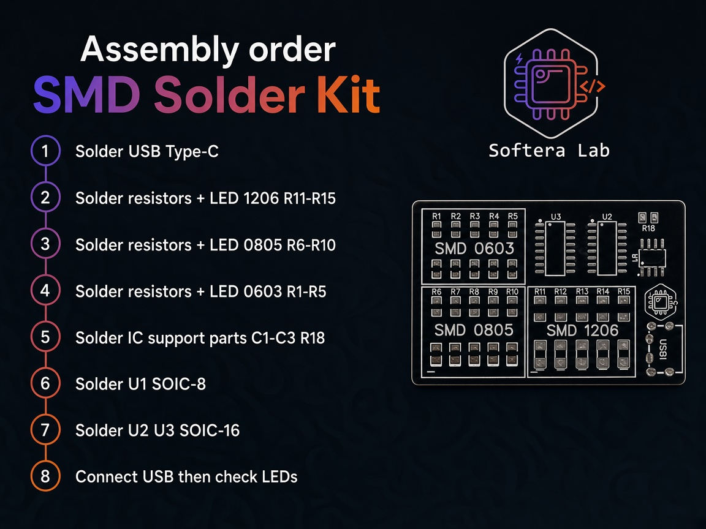

  

<h1 align="center">SMD Solder Kit · SK-40</h1>

<strong>Softera Lab training board for SMD soldering practice</strong>

  
  
  
  
  

<strong>Languages:</strong> English (this page) · <a href="README.uk.md">Українська</a>

  

Softera Lab kit for practicing SMD soldering. This repository is a **product page and assembly guide** for people who want to buy the kit or join the [soldering course](https://www.softeralab.com/course-basic-soldering/).

This is **not an open-source hardware project**. Schematics source, Gerbers, and manufacturing files are not published.

> © Softera Lab. All rights reserved. Copying the board, schematic, or manufacturing files without written permission is prohibited.

## How it works

Video of ready to work KIT: [YouTube Short](https://www.youtube.com/shorts/_bBBfhrwp9k)

## About the kit

[SMD Solder Kit SK-40](https://www.softeralab.com/course-basic-soldering/) is a practice board from [Softera Lab](https://www.softeralab.com/). It has three resistor + LED sections in **1206**, **0805**, and **0603**, plus USB Type-C at **5 V**.

There is **no microcontroller**. Timing comes from a **555** timer (U1, SOIC-8). LED stepping is handled by two **4017** counters (U2 and U3, SOIC-16).

The other side of the board is a package reference: Metric/Inch sizes, SOT footprints, and a Speed section.

Step-by-step assembly lives in [`docs/`](docs/) (Ukrainian guide for the course).

  

## Specifications

| Parameter | Value |
| --- | --- |
| Product | SMD Solder Kit · SK-40 |
| Input | USB Type-C, 5 V |
| Indicators | Section LED lights when that section is soldered correctly |
| LED sections | 1206 (R11–R15), 0805 (R6–R10), 0603 (R1–R5) |
| Logic | 555 timer (U1, SOIC-8) and two 4017 (U2, U3, SOIC-16). No MCU |
| Support parts | C1–C3, R18 |
| Reference side | Metric/Inch table, SOT-23 / SOT-25 / SOT-26 / SOT-89, Speed section |
| Check | Connect USB and watch the LEDs |

  

## What's in the box

  

1. SMD Solder Kit board
2. Resistors 0603, 0805, 1206
3. LEDs 0603, 0805, 1206
4. 555 timer (SOIC-8) and two 4017 ICs (SOIC-16)
5. Support components for the ICs
6. USB Type-C connector
7. Consumables: flux, solder, board cleaner

## Assembly (short)

Full order and tools: [getting started](docs/02-getting-started.md).

1. Solder USB Type-C
2. 1206 section: resistors R11–R15 + LED
3. 0805 section: resistors R6–R10 + LED
4. 0603 section: resistors R1–R5 + LED
5. IC support parts: C1–C3, R18
6. U1 — 555, SOIC-8
7. U2 and U3 — 4017, SOIC-16
8. Connect USB and check LEDs

  

## Links

| Item | Where |
| --- | --- |
| Ukrainian README | [README.uk.md](README.uk.md) |
| Board overview | [docs/01-hardware-overview.md](docs/01-hardware-overview.md) |
| Tools & assembly | [docs/02-getting-started.md](docs/02-getting-started.md) |
| Soldering technique | [docs/03-soldering.md](docs/03-soldering.md) |
| Troubleshooting | [docs/04-troubleshooting.md](docs/04-troubleshooting.md) |
| Buy / course | [Soldering course](https://www.softeralab.com/course-basic-soldering/) |
| Website | [softeralab.com](https://www.softeralab.com/) |
| Contact | [Contacts](https://www.softeralab.com/our-contacts/) · support@softeralab.com |
| Instagram | [instagram.com/softeralab](https://www.instagram.com/softeralab/) |
| YouTube channel | [youtube.com/@SofteraLab](https://www.youtube.com/@SofteraLab) |
| Demo video | [YouTube Short](https://www.youtube.com/shorts/_bBBfhrwp9k) |

## Copyright

© Softera Lab. All rights reserved.

Public materials may be viewed. You may not copy, manufacture, redistribute, or commercially use the board design without written permission from Softera Lab.
