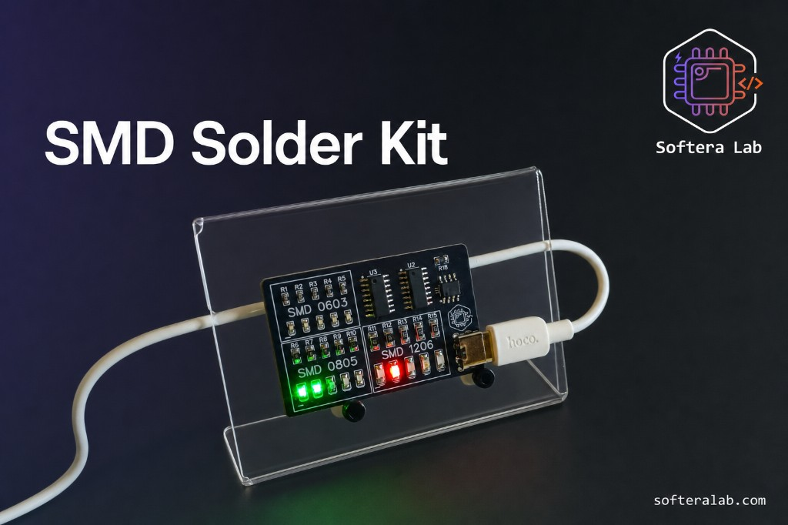
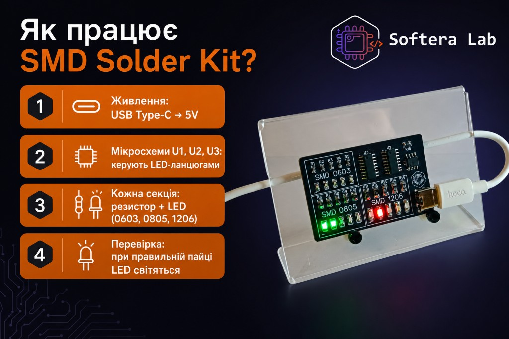
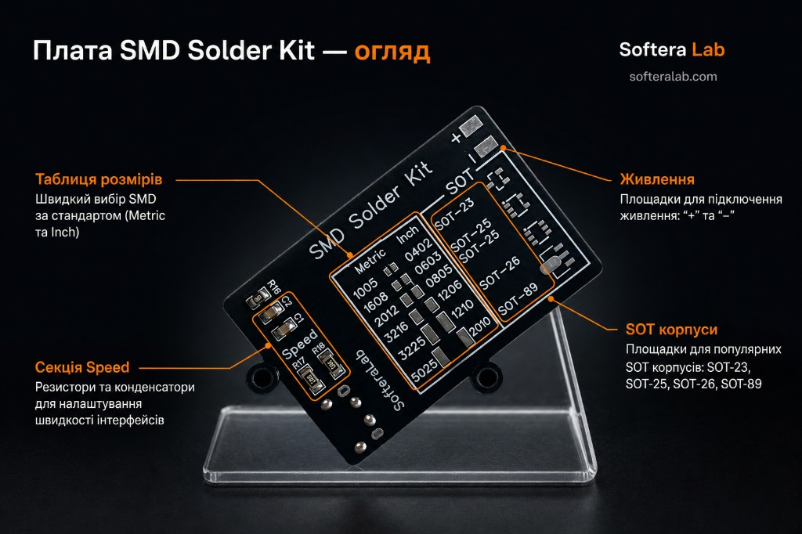
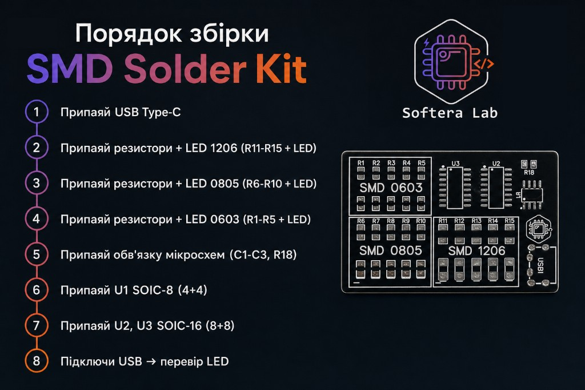

  

<h1 align="center">SMD Solder Kit · SK40</h1>

<strong>Навчальна плата Softera Lab для пайки SMD</strong>

  
  
  
  

Набір Softera Lab для тренування пайки SMD. Ця сторінка — опис і інструкція для тих, кому цікаво купити набір або пройти [курс пайки](https://www.softeralab.com/course-basic-soldering/). Це **не open-source проєкт**: схема, Gerber і виробничі файли публічно не викладаються.

> © Softera Lab. All rights reserved. Копіювання плати, схеми та виробничих файлів без письмового дозволу заборонене.

## Про набір

[SMD Solder Kit](https://www.softeralab.com/course-basic-soldering/) — практична плата [Softera Lab](https://www.softeralab.com/). На ній три секції «резистор + LED» у корпусах 1206, 0805 і 0603 та роз’єм USB Type-C на 5 В. Мікроконтролера на платі немає: такти задає таймер **555** (U1, SOIC-8), а кроки по світлодіодах рахують дві мікросхеми **4017** (U2 і U3, SOIC-16).

Окремий бік плати тримає довідник корпусів: метричні й дюймові розміри, площадки SOT і секцію Speed.

Ця сторінка — вхід у репозиторій. Покроковий монтаж лежить у [`docs/`](docs/).

## Відео роботи зібраного набору

[YouTube Short: SMD soldering kit by Softera Lab](https://www.youtube.com/shorts/_bBBfhrwp9k)

## Характеристики

Та сама таблиця повторюється в [огляді плати](docs/01-hardware-overview.md).

| Parameter | Value |
| --- | --- |
| Product | SMD Solder Kit · SK40 |
| Input | USB Type-C, 5 V |
| Indicators | LED секції світиться, якщо пайка цієї секції правильна |
| LED sections | 1206 (R11–R15), 0805 (R6–R10), 0603 (R1–R5) |
| Logic | Таймер 555 (U1, SOIC-8) і дві 4017 (U2, U3, SOIC-16) |
| Support parts | C1–C3, R18 |
| Reference side | Таблиця Metric/Inch, SOT-23 / SOT-25 / SOT-26 / SOT-89, секція Speed |
| Check | Підключити USB і подивитись на LED |

## Що в коробці

1. Плата SMD Solder Kit.
2. Набір резисторів 0603, 0805, 1206.
3. Набір світлодіодів 0603, 0805, 1206.
4. Таймер 555 у SOIC-8 і дві мікросхеми 4017 у SOIC-16.
5. Набір компонентів обв’язки мікросхем.
6. Роз’єм USB Type-C.
7. Витратні матеріали: флюс, припій, змивка для плат.

## Збірка коротко

Повний порядок і інструменти: [перший запуск](docs/02-getting-started.md).

1. Припаяй USB Type-C.
2. Секція 1206: резистори R11–R15 і LED.
3. Секція 0805: резистори R6–R10 і LED.
4. Секція 0603: резистори R1–R5 і LED.
5. Обв’язка мікросхем: C1–C3, R18.
6. U1 — таймер 555, корпус SOIC-8.
7. U2 і U3 — лічильники 4017, корпус SOIC-16.
8. Підключи USB і перевір LED.

## Посилання

| Матеріал | Де |
| --- | --- |
| Огляд плати | [docs/01-hardware-overview.md](docs/01-hardware-overview.md) |
| Інструменти і збірка | [docs/02-getting-started.md](docs/02-getting-started.md) |
| Техніка пайки | [docs/03-soldering.md](docs/03-soldering.md) |
| Якщо LED не світиться | [docs/04-troubleshooting.md](docs/04-troubleshooting.md) |
| Купити / записатись | [Курс пайки](https://www.softeralab.com/course-basic-soldering/) · [Контакти](https://www.softeralab.com/our-contacts/) |
| Сайт | [softeralab.com](https://www.softeralab.com/) |
| Контакти | [сторінка контактів](https://www.softeralab.com/our-contacts/) · softeralab@gmail.com · +38 (096) 22-67-529 |
| Instagram | [Сторінка Softera Lab](https://www.instagram.com/softeralab/) |
| YouTube | [Канал Softera Lab](https://www.youtube.com/@SofteraLab) |
| GitHub | [github.com/SofteraLab](https://github.com/SofteraLab) |

## Copyright

© Softera Lab. All rights reserved.

Цей репозиторій показує продукт Softera Lab для ознайомлення та покупки. Дозволено переглядати публічні матеріали. Заборонено копіювати, відтворювати чи виготовляти плату за цими матеріалами, викладати дзеркала репозиторію та використовувати дизайн у комерційних цілях без письмового дозволу Softera Lab.
