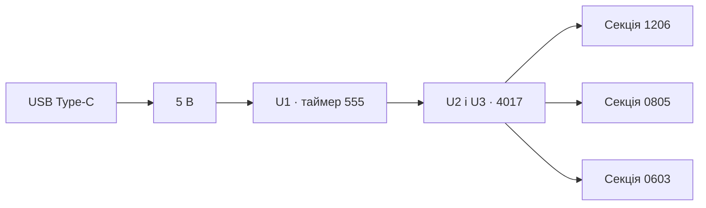
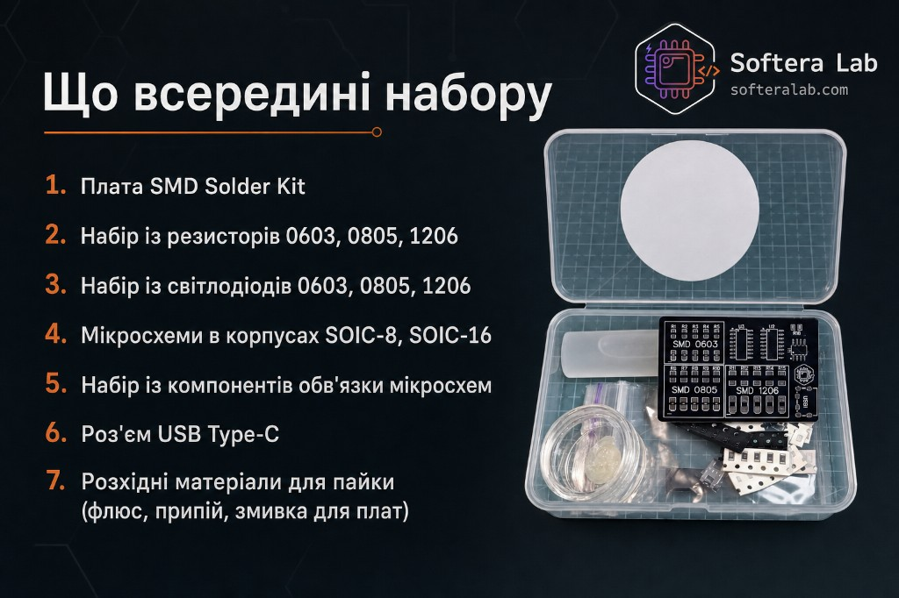

Апаратна частина

# Огляд плати

SMD Solder Kit — навчальна плата Softera Lab. Вона вчить паяти SMD і сама показує результат: ланцюг світлодіодів загоряється, коли секція зібрана правильно.

Мікроконтролера на платі немає і прошивати нічого. Такт дає таймер 555 на місці U1. Дві мікросхеми 4017 на місцях U2 і U3 по черзі вмикають світлодіоди.

## Характеристики

| Parameter | Value | Notes |
| --- | --- | --- |
| Product | SMD Solder Kit | Навчальний набір пайки |
| Input | USB Type-C, 5 V | Єдине живлення зібраної плати на картці набору |
| Indicators | LED секції | Світиться при правильній пайці цієї секції |
| Sections | 1206, 0805, 0603 | У кожній секції резистор і LED |
| U1 | Таймер 555, SOIC-8 (4+4) | Задає такт. Мікроконтролером не є |
| U2, U3 | Лічильник 4017, SOIC-16 (8+8) | Дві однакові мікросхеми, крокують по LED |
| Support | C1–C3, R18 | Обв’язка мікросхем |
| Reference | Metric/Inch, SOT, Speed | Другий бік плати на картці огляду |

:::caution Живлення
На зібрану плату подають 5 В через USB Type-C. Площадки «+» і «−» на боці огляду — це контакти живлення, їх не міняють місцями.
:::

## Як плата перетворює пайку на світло

| Крок на картці | Що відбувається |
| --- | --- |
| 1. Живлення | USB Type-C подає 5 В |
| 2. Логіка | U1 — таймер 555, U2 і U3 — лічильники 4017 |
| 3. Секція | Пара «резистор + LED» у корпусі 0603, 0805 або 1206 |
| 4. Перевірка | При правильній пайці LED світиться |

На зібраному зразку секції 0603 і 0805 світяться зеленим, секція 1206 — червоним.

## Секції пайки

| Секція | Позначення | Корпус | Коли паяти |
| --- | --- | --- | --- |
| 1206 | R11–R15 і LED | 1206 | Одразу після роз’єму USB |
| 0805 | R6–R10 і LED | 0805, 2.0 × 1.25 мм | Після 1206 |
| 0603 | R1–R5 і LED | 0603, 1.6 × 0.8 мм | Після 0805 |
| Обв’язка | C1–C3, R18 | SMD поруч із мікросхемами | Перед корпусами IC |
| U1 | Таймер 555 | SOIC-8 | Після обв’язки |
| U2, U3 | Лічильник 4017 | SOIC-16 | Останні мікросхеми перед перевіркою |
| Живлення | USB | USB Type-C | Перший крок монтажу |

## Бік із довідником корпусів

| Зона | Що на шовкографії | Навіщо |
| --- | --- | --- |
| Таблиця розмірів | Metric і Inch | Швидко зіставити корпус із майданчиком |
| Speed | R17, R18, резистори та конденсатори | Площадки для компонентів, якими задають швидкість інтерфейсу |
| Живлення | «+» і «−» | Контакти живлення |
| SOT | SOT-23, SOT-25, SOT-26, SOT-89 | Площадки популярних корпусів |

Відповідність розмірів на таблиці плати:

| Metric | Inch |
| --- | --- |
| 1005 | 0402 |
| 1608 | 0603 |
| 2012 | 0805 |
| 3216 | 1206 |
| 3225 | 1210 |
| 5025 | 2010 |

## Комплектація

| № | Позиція |
| --- | --- |
| 1 | Плата SMD Solder Kit |
| 2 | Резистори 0603, 0805, 1206 |
| 3 | Світлодіоди 0603, 0805, 1206 |
| 4 | Таймер 555 (SOIC-8) і дві 4017 (SOIC-16) |
| 5 | Компоненти обв’язки мікросхем |
| 6 | Роз’єм USB Type-C |
| 7 | Флюс, припій, змивка для плат |

Файли KiCad, Gerber і PDF цієї ревізії кладуть у [`hardware/`](../hardware/). Номінали з BOM дописують у таблицю характеристик, коли схема з’явиться поруч із картками.
