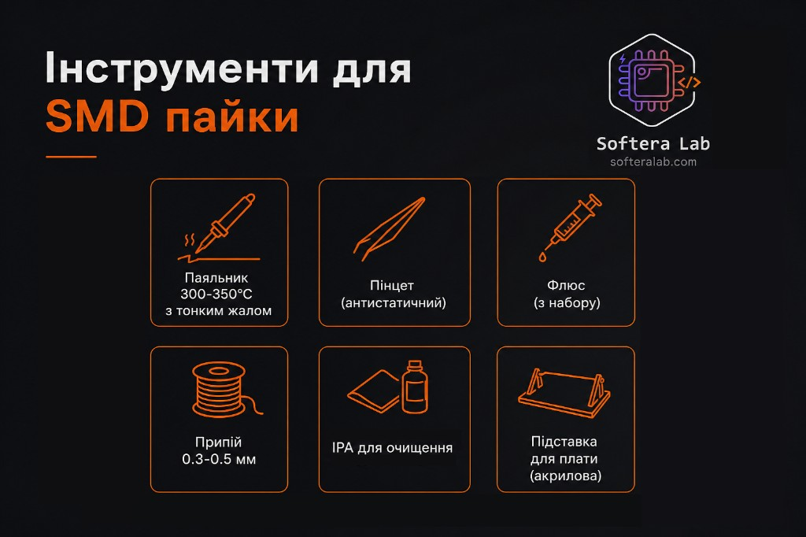
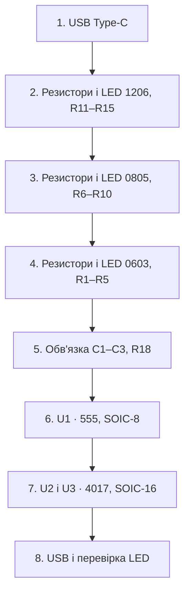

Перший запуск

# Збірка набору

Прошивки немає: після подачі 5 В таймер 555 на U1 тактує дві мікросхеми 4017 на U2 і U3, і ті вмикають світлодіоди. Готовність видно по LED.

## Інструменти

| Інструмент | Як у наборі |
| --- | --- |
| Паяльник | 300–350 °C, тонке жало |
| Пінцет | Антистатичний |
| Флюс | З набору |
| Припій | Дріт 0.3–0.5 мм |
| Змивка | IPA |
| Підставка | Акрилова, під плату |

:::caution Температура
Тримайте жало в діапазоні 300–350 °C. Світлодіод і корпус мікросхеми не гріють довше, ніж потрібно, щоб припій змочив площадку.
:::

## Перед пайкою

1. Розкладіть компоненти за корпусами: 1206, потім 0805, потім 0603. Дрібне не змішуйте з крупним.
2. Поставте плату на акрилову підставку.
3. Нанесіть флюс на групу площадок, яку паяєте зараз, а не на всю плату одразу.

## Вісім кроків

| Крок | Дія |
| --- | --- |
| 1 | Припаяти роз’єм USB Type-C |
| 2 | Припаяти резистори і LED секції 1206, позначення R11–R15 |
| 3 | Припаяти резистори і LED секції 0805, позначення R6–R10 |
| 4 | Припаяти резистори і LED секції 0603, позначення R1–R5 |
| 5 | Припаяти обв’язку мікросхем: C1, C2, C3, R18 |
| 6 | Припаяти U1 — таймер 555 у корпусі SOIC-8 |
| 7 | Припаяти U2 і U3 — лічильники 4017 у корпусі SOIC-16 |
| 8 | Підключити USB і перевірити LED |

Корпуси йдуть від більшого до меншого: 1206, потім 0805, потім 0603. Так рука встигає зловити масштаб до найдрібнішої секції. Прийом для двох менших корпусів розібраний у [техніці пайки](./03-soldering.md).

## Перевірка

1. Дайте платі охолонути і змийте флюс засобом IPA.
2. Огляньте виводи U1, U2 і U3: сусідні ніжки не з’єднані перемичкою припою.
3. Підключіть кабель USB з лініями живлення. Для цієї перевірки дані не потрібні, порт має давати 5 В.
4. LED секцій світяться. На зразку з картки 0603 і 0805 зелені, 1206 червоний.

Темна секція — це ще не зіпсована плата. Порядок пошуку причини зібраний у [діагностиці](./04-troubleshooting.md).
