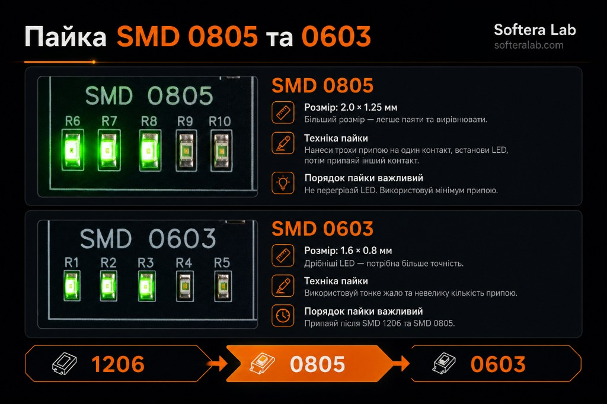
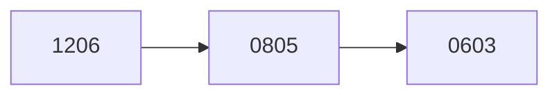

Пайка

# Техніка пайки

Секції паяють від крупного корпусу до дрібного. 1206 дає запас по площі, 0805 закріплює рух, 0603 вже вимагає тонкого жала і короткого дотику.

## Порядок корпусів

| Корпус | Розмір | Де на платі | Чому в цьому місці черги |
| --- | --- | --- | --- |
| 1206 | Найбільший із трьох LED-секцій | R11–R15 і LED | Перша секція після USB |
| 0805 | 2.0 × 1.25 мм | R6–R10 і LED | Легше вирівняти, ніж 0603 |
| 0603 | 1.6 × 0.8 мм | R1–R5 і LED | Лише після 1206 і 0805 |

## Один прийом на обидва дрібні корпуси

1. Нанесіть трохи припою на одну площадку.
2. Пінцетом поставте LED або резистор і прогрійте цю площадку, щоб корпус сів рівно.
3. Припаяйте другий контакт.
4. Для світлодіода візьміть мінімум припою і не тримайте жало на корпусі.

Для 0603 жало тонше, припою менше. Решта руху та сама.

:::note Світлодіод гріється швидше за резистор
Крапля на першій площадці вже тримає корпус. Другий контакт лише змочують. Довгий прогрів гасить LED ще до перевірки від USB.
:::

## Мікросхеми

| Позначення | Мікросхема | Корпус | Виводів з кожного боку | Коли |
| --- | --- | --- | --- | --- |
| U1 | Таймер 555 | SOIC-8 | 4 | Після C1–C3 і R18 |
| U2 | Лічильник 4017 | SOIC-16 | 8 | Разом з U3, перед перевіркою |
| U3 | Лічильник 4017 | SOIC-16 | 8 | Разом з U2 |

555 і 4017 не взаємозамінні: у таймера 8 виводів, у лічильника 16. Порожнє місце U1 не прийме корпус U2.

Посадка SOIC:

1. Звірте перший вивід корпусу з міткою на шовкографії.
2. Прихопіть дві діагональні ніжки.
3. Якщо корпус сів рівно, пройдіть решту виводів.
4. Місток між сусідами знімають опліткою або жалом з невеликою кількістю флюсу, доки щілина між ніжками знову чиста.

## Довідкові площадки

На боці огляду є майданчики, які не входять у вісім кроків LED-збірки. Їх паяють, коли рука вже пройшла 1206, 0805 і 0603.

| Зона | Корпуси |
| --- | --- |
| Таблиця розмірів | 1005/0402, 1608/0603, 2012/0805, 3216/1206, 3225/1210, 5025/2010 |
| SOT | SOT-23, SOT-25, SOT-26, SOT-89 |
| Speed | Резистори та конденсатори секції, на шовкографії R17 і R18 |

