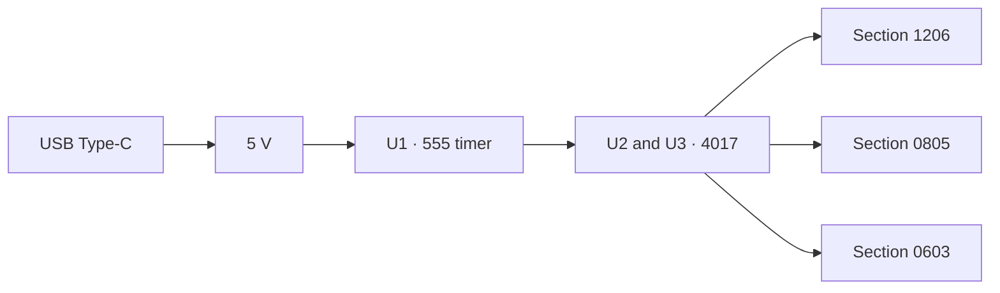

Hardware

# Board overview

SMD Solder Kit is a Softera Lab training board. It teaches SMD soldering and shows the result: the LED chain lights when a section is assembled correctly.

There is no microcontroller and nothing to flash. Timing comes from a 555 timer at U1. Two 4017 counters at U2 and U3 step through the LEDs.

## Specifications

| Parameter | Value | Notes |
| --- | --- | --- |
| Product | SMD Solder Kit | Soldering practice kit |
| Input | USB Type-C, 5 V | Power for the assembled board |
| Indicators | Section LEDs | Lit when that section is soldered correctly |
| Sections | 1206, 0805, 0603 | Resistor + LED in each section |
| U1 | 555 timer, SOIC-8 (4+4) | Sets the clock. Not an MCU |
| U2, U3 | 4017 counter, SOIC-16 (8+8) | Two identical ICs stepping the LEDs |
| Support | C1–C3, R18 | IC support parts |
| Reference | Metric/Inch, SOT, Speed | Second side of the board |

:::caution Power
Feed the assembled board 5 V through USB Type-C. The “+” and “−” pads on the reference side are power contacts — do not swap them.
:::

## How soldering becomes light

| Card step | What happens |
| --- | --- |
| 1. Power | USB Type-C supplies 5 V |
| 2. Logic | U1 — 555 timer, U2 and U3 — 4017 counters |
| 3. Section | Resistor + LED pair in 0603, 0805, or 1206 |
| 4. Check | Correct soldering → LED lights |

On the assembled sample, sections 0603 and 0805 light green; section 1206 lights red.

## Soldering sections

| Section | Designators | Package | When to solder |
| --- | --- | --- | --- |
| 1206 | R11–R15 and LED | 1206 | Right after the USB connector |
| 0805 | R6–R10 and LED | 0805, 2.0 × 1.25 mm | After 1206 |
| 0603 | R1–R5 and LED | 0603, 1.6 × 0.8 mm | After 0805 |
| Support | C1–C3, R18 | SMD next to the ICs | Before the IC packages |
| U1 | 555 timer | SOIC-8 | After support parts |
| U2, U3 | 4017 counters | SOIC-16 | Last ICs before the check |
| Power | USB | USB Type-C | First assembly step |

## Package reference side

| Zone | Silkscreen | Purpose |
| --- | --- | --- |
| Size table | Metric and Inch | Match package to footprint quickly |
| Speed | R17, R18, resistors and capacitors | Pads for interface-speed parts |
| Power | “+” and “−” | Power contacts |
| SOT | SOT-23, SOT-25, SOT-26, SOT-89 | Common package footprints |

Size table on the board:

| Metric | Inch |
| --- | --- |
| 1005 | 0402 |
| 1608 | 0603 |
| 2012 | 0805 |
| 3216 | 1206 |
| 3225 | 1210 |
| 5025 | 2010 |

## Kit contents

| # | Item |
| --- | --- |
| 1 | SMD Solder Kit board |
| 2 | Resistors 0603, 0805, 1206 |
| 3 | LEDs 0603, 0805, 1206 |
| 4 | 555 timer (SOIC-8) and two 4017 (SOIC-16) |
| 5 | IC support components |
| 6 | USB Type-C connector |
| 7 | Flux, solder, board cleaner |

KiCad, Gerber, and PDF files for this revision belong in [`hardware/`](../../hardware/). BOM values are filled into the specs table when the schematic is published next to the cards.
