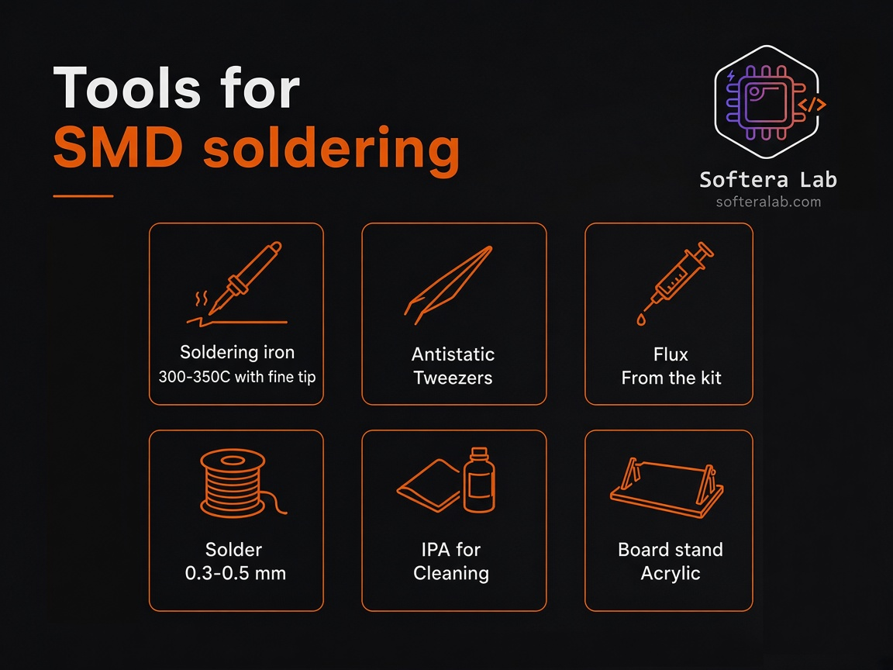
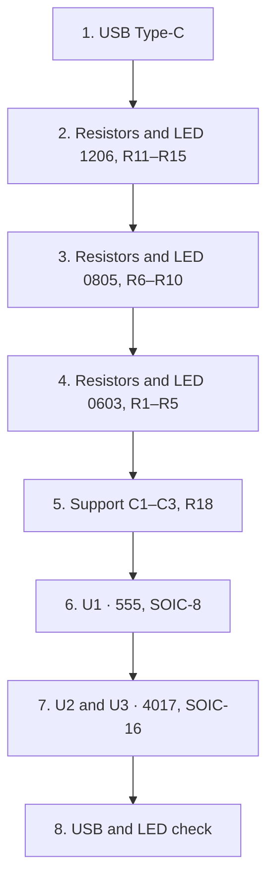

Getting started

# Assembly

There is no firmware: after 5 V is applied, the 555 timer at U1 clocks two 4017 counters at U2 and U3, and those turn on the LEDs. Readiness is visible on the LEDs.

## Tools

| Tool | As used with the kit |
| --- | --- |
| Soldering iron | 300–350 °C, fine tip |
| Tweezers | Antistatic |
| Flux | From the kit |
| Solder | 0.3–0.5 mm wire |
| Cleaner | IPA |
| Stand | Acrylic board stand |

:::caution Temperature
Keep the tip at 300–350 °C. Do not heat an LED or IC package longer than needed for the solder to wet the pad.
:::

## Before soldering

1. Sort parts by package: 1206, then 0805, then 0603. Do not mix small and large parts.
2. Place the board on the acrylic stand.
3. Apply flux only to the pad group you are soldering now — not the whole board at once.

## Eight steps

| Step | Action |
| --- | --- |
| 1 | Solder the USB Type-C connector |
| 2 | Solder resistors and LED for section 1206, R11–R15 |
| 3 | Solder resistors and LED for section 0805, R6–R10 |
| 4 | Solder resistors and LED for section 0603, R1–R5 |
| 5 | Solder IC support parts: C1, C2, C3, R18 |
| 6 | Solder U1 — 555 timer in SOIC-8 |
| 7 | Solder U2 and U3 — 4017 counters in SOIC-16 |
| 8 | Connect USB and check the LEDs |

Packages go from larger to smaller: 1206, then 0805, then 0603. That way you get used to the scale before the smallest section. The technique for the two smaller packages is in [soldering technique](./03-soldering.md).

## Check

1. Let the board cool and clean flux with IPA.
2. Inspect U1, U2, and U3 pins: no solder bridges between adjacent leads.
3. Connect a USB cable that provides power. Data lines are not needed for this check; the port must supply 5 V.
4. Section LEDs light. On the sample card, 0603 and 0805 are green; 1206 is red.

A dark section does not mean a ruined board. The fault-finding order is in [troubleshooting](./04-troubleshooting.md).
