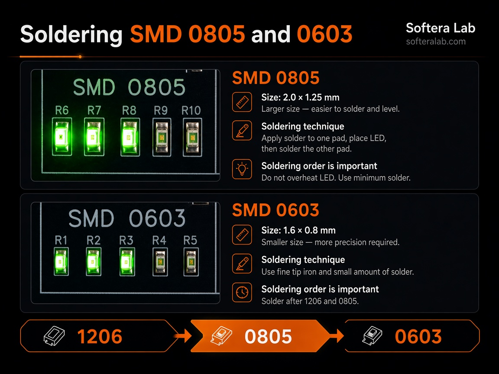
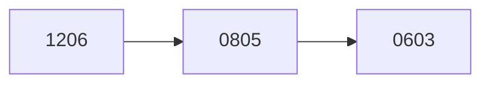

Soldering

# Soldering technique

Solder sections from larger package to smaller. 1206 gives pad area, 0805 locks in the motion, 0603 needs a fine tip and a short touch.

## Package order

| Package | Size | On the board | Why this place in the queue |
| --- | --- | --- | --- |
| 1206 | Largest of the three LED sections | R11–R15 and LED | First section after USB |
| 0805 | 2.0 × 1.25 mm | R6–R10 and LED | Easier to align than 0603 |
| 0603 | 1.6 × 0.8 mm | R1–R5 and LED | Only after 1206 and 0805 |

## One method for both small packages

1. Put a little solder on one pad.
2. Place the LED or resistor with tweezers and reheat that pad so the part sits flat.
3. Solder the second contact.
4. For an LED, use minimal solder and do not leave the tip on the package.

For 0603 the tip is finer and there is less solder. The rest of the motion is the same.

:::note LEDs heat faster than resistors
A blob on the first pad already holds the part. The second contact is only wetted. Long heating can kill the LED before the USB check.
:::

## ICs

| Ref | Part | Package | Pins per side | When |
| --- | --- | --- | --- | --- |
| U1 | 555 timer | SOIC-8 | 4 | After C1–C3 and R18 |
| U2 | 4017 counter | SOIC-16 | 8 | With U3, before the check |
| U3 | 4017 counter | SOIC-16 | 8 | With U2 |

555 and 4017 are not interchangeable: the timer has 8 pins, the counter has 16. An empty U1 footprint will not accept a U2 package.

SOIC placement:

1. Match pin 1 on the package with the silkscreen mark.
2. Tack two diagonal pins.
3. If the package sits flat, solder the rest.
4. Clear bridges between neighbors with braid or a tip plus a little flux until the gap between pins is clean again.

## Reference pads

The overview side has pads that are not part of the eight LED-assembly steps. Solder them after you have already done 1206, 0805, and 0603.

| Zone | Packages |
| --- | --- |
| Size table | 1005/0402, 1608/0603, 2012/0805, 3216/1206, 3225/1210, 5025/2010 |
| SOT | SOT-23, SOT-25, SOT-26, SOT-89 |
| Speed | Resistors and capacitors in that section; silkscreen R17 and R18 |

